## 基于 VirtualBox 的网络攻防基础环境搭建

### 实验目的

- 掌握 VirtualBox 虚拟机的安装与使用
- 掌握 VirtualBox 的虚拟网络类型和按需配置
- 掌握 VirtualBox 的虚拟硬盘多重加载

### 实验环境

- VirtualBox 虚拟机
- 攻击者主机（Attacker）：Kali Rolling 2109.2
- 网关（Gateway, GW）：Debian Buster
- 靶机（Victim）：From Sqli to shell / xp-sp3 / Kali

### 实验要求

- [x] 虚拟硬盘配置成多重加载

- [x] 搭建拓扑图

- [x] 靶机可以直接访问攻击者主机

- [x] 攻击者主机无法直接访问靶机

- [x] 网关可以直接访问攻击者主机和靶机

- [x] 靶机的所有对外上下行流量必须经过网关

- [x] 所有节点均可以访问互联网


### 实验过程

- **虚拟硬盘配置成多重加载**

    - 将文件导入虚拟机中

        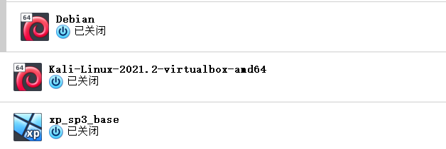

    - 从 `管理——虚拟介质管理` 打开虚拟介质管理器，点击 `释放` ，并将类型改为 `多重加载`

        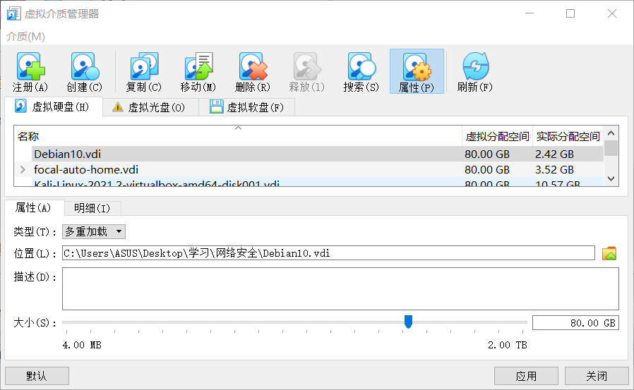

    - 点击 `设置——存储` ，在 `控制器` 下添加多重加载的vdi文件

        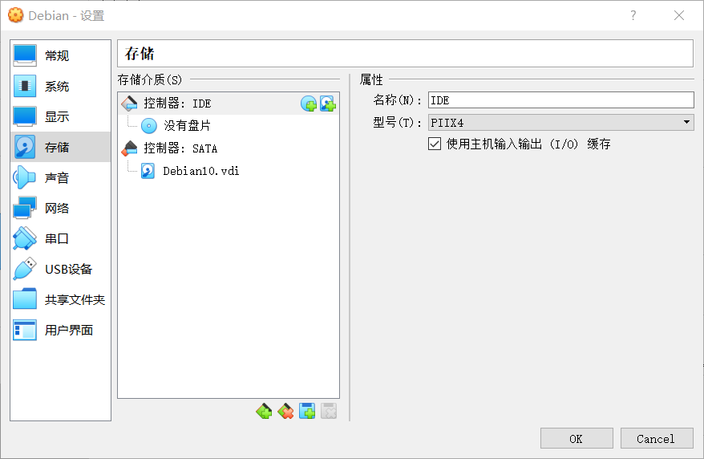

    - 使用 `多重加载` 创建实验所用的实验机
   
        

- **搭建拓扑图**

  

  - 网关配置

    |    NAT    |   Host-Only   |   intnet1    |   intnet2    |
    | :-------: | :-----------: | :----------: | :----------: |
    | 10.0.2.15 | 192.168.93.14 | 172.16.111.1 | 172.16.222.1 |
    
    - NAT网络：网关可以访问攻击者主机
    - Host-Only：方便使用ssh
    - 内部网络：内部局域网

        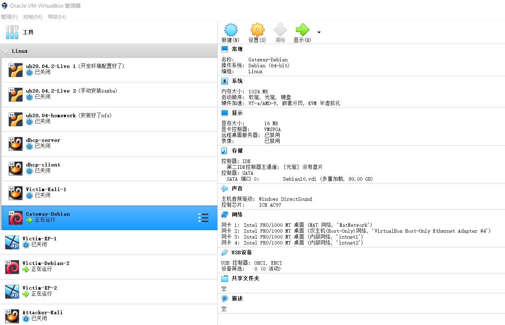
    
  	- 查看ip并配置免密登录

    	```vb
    	ssh-copy-id -i ~/.ssh/id_rsa.pub root@192.168.93.14
    	```

  - 靶机配置

    |      XP-1      |     Kali-1     |      XP-2      |    Debian-2    |
    | :------------: | :------------: | :------------: | :------------: |
    | 172.16.111.135 | 172.16.111.110 | 172.16.222.141 | 172.16.222.114 |

    - 将 `Victim-Kali-1` 和 `Victim-XP-1` 的网卡设置为 `intnet1`

      

    - 因为XP系统没有千兆网驱动，所以控制芯片选择 `PCnet-FAST`

      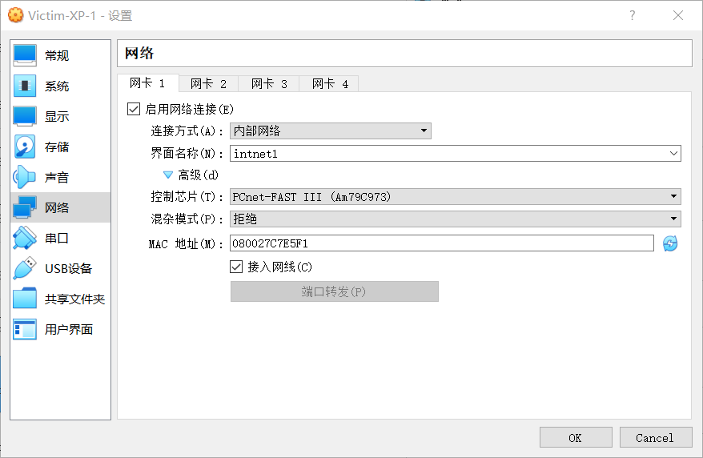

    - `Victim-Debian-2` 和 `Victim-XP-2` 的网卡按照上述操作配置成 `intnet2`

  - 攻击者配置

    - IP地址：`10.0.2.5`

    - 选择 `NAT网络`

      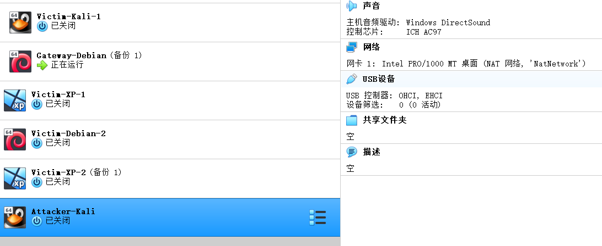

- **靶机可以直接访问攻击者主机（图片中攻击者主机ip地址不一致的原因是重建网关后攻击者ip地址更改）**

  - Victim-Kali-1

    

  - Victim-XP-1

    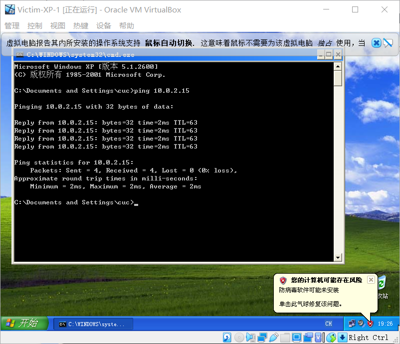

  - Victim-Debian-2

    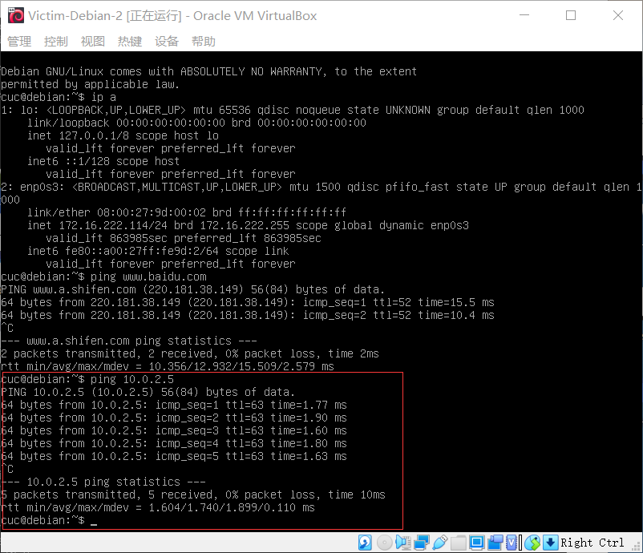

  - Victim-XP-2

    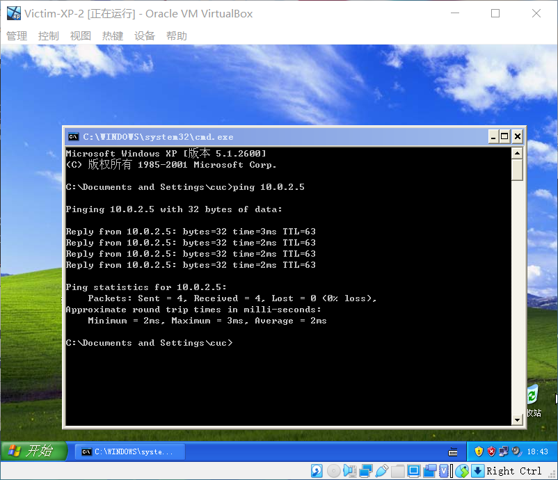

- **攻击者主机无法直接访问靶机**

  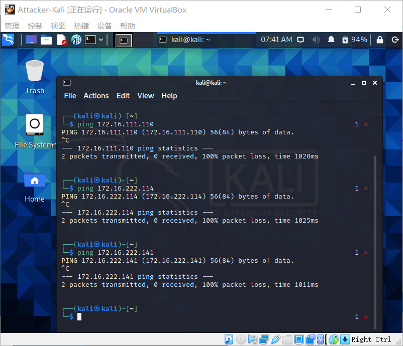

- **网关可以直接访问攻击者主机和靶机【必须关掉XP的防火墙】**

  - Attacker-Kali

    

  - Victim-XP-1

    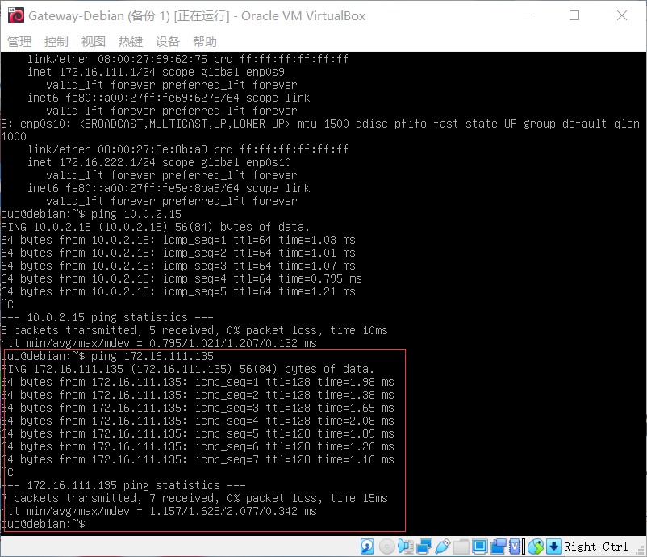

  - Victim-Kali-1

    

  - Victim-XP-2

    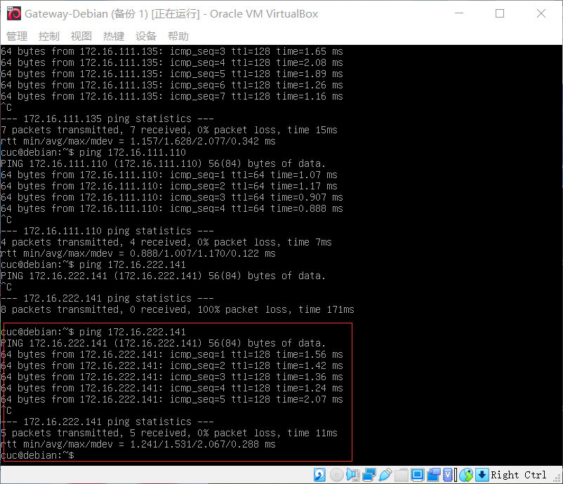

  - Victim-Debian-2

    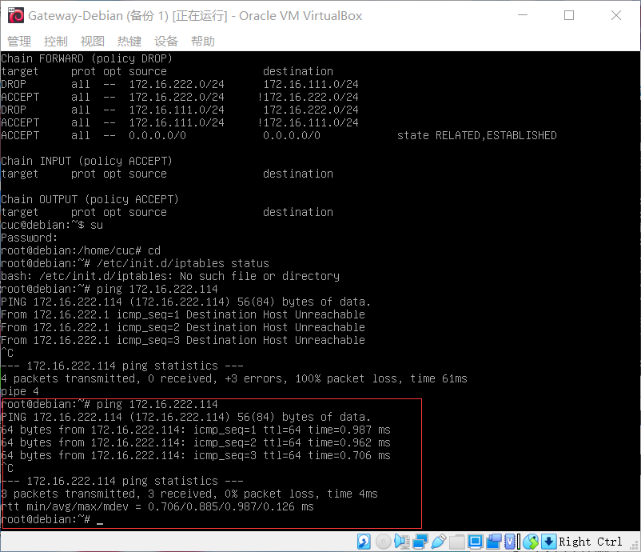

- **靶机的所有对外上下行流量必须经过网关【以 `Victim-XP-1` 为例】**

    - 在 XP-1 访问互联网的同时，网关进行抓包

        ```bash
        sudo tcpdump -i enp0s9 -n -w 20210909.1.pcap
        ```

        

    - 将文件复制到本机桌面上

      ```bash
      scp cuc@192.168.93.13:/home/cuc/workspace/20210909.1.pcap ./
      ```

      

    - 打开 `Wireshark` 进行抓包分析，可以看到靶机访问互联网的流量必须经过网关

      

- **所有节点均可以访问互联网**

  - Attacker-Kali

    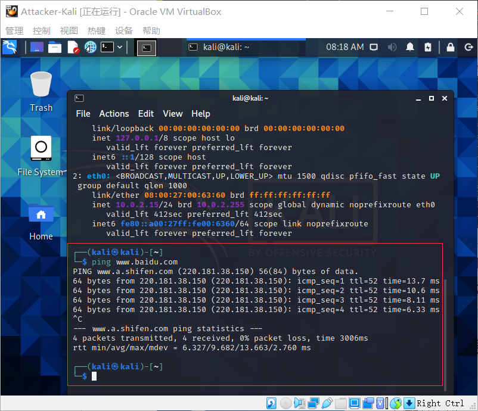

  - 网关

    

  - Victim-Kali-1

    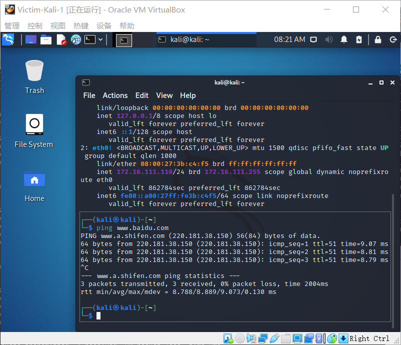

  - Victim-XP-1

    

  - Victim-Debian-2

    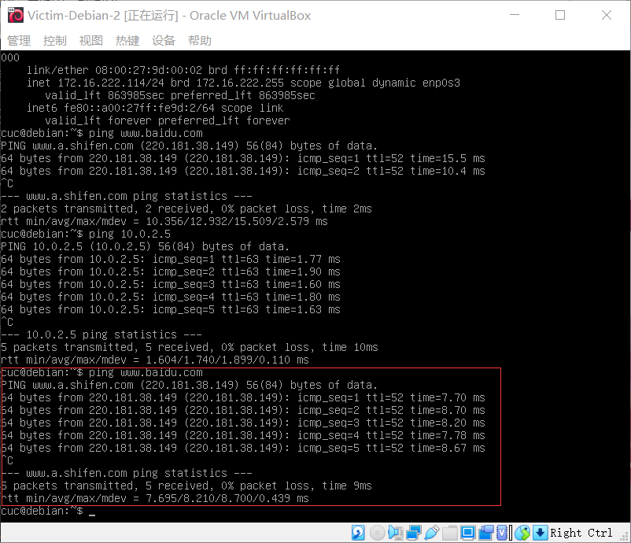

  - Victim-XP-2

    

### 实验遇到的问题

#### 问题一

- 无法打开网关

    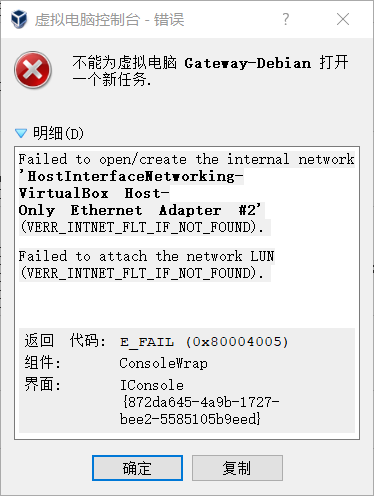

- **解决方法**

    - [更新网卡驱动](https://www.jianshu.com/p/4bee5f609d01)

#### 问题二

- ssh登录超时

    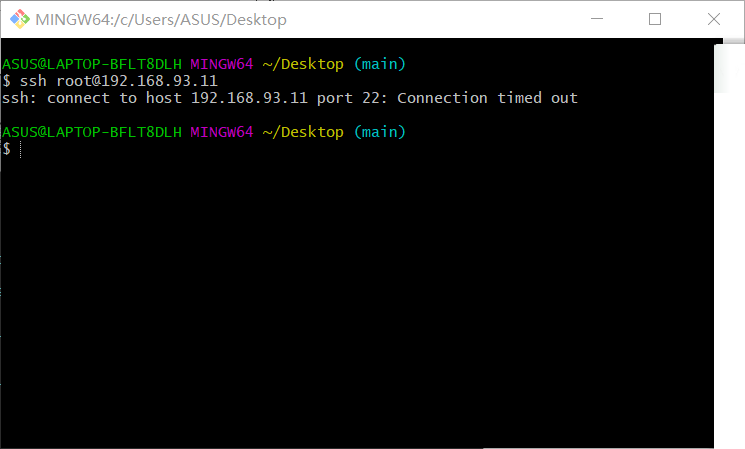

- **解决方法**

    - 以 `管理员身份` 打开Windows中的 `PowderShell` ，输入 `net start sshd`
    - 手动配置的网卡，ip地址应为 `xxx.xxx.xxx.1`

#### 问题三

- ssh无法登录root用户

    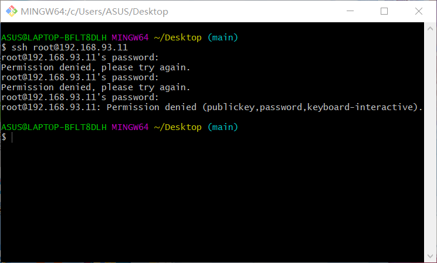

- **解决方法**

    - [ssh远程登录root用户](https://www.cnblogs.com/banxian-yi/p/12361606.html)

#### 问题四

- 免密登录出现问题

    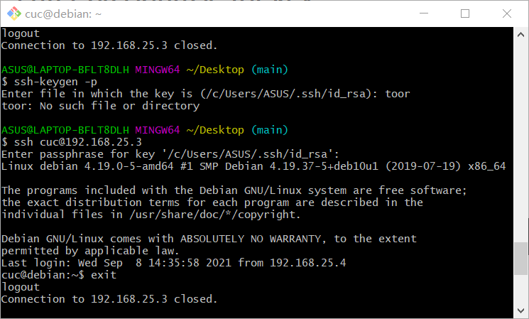

- **解决方法**

    - 在 `Git-Bash` 中输入 `ssh-keygen -p`

#### 问题五

- 内部网络2的主机无法访问互联网

	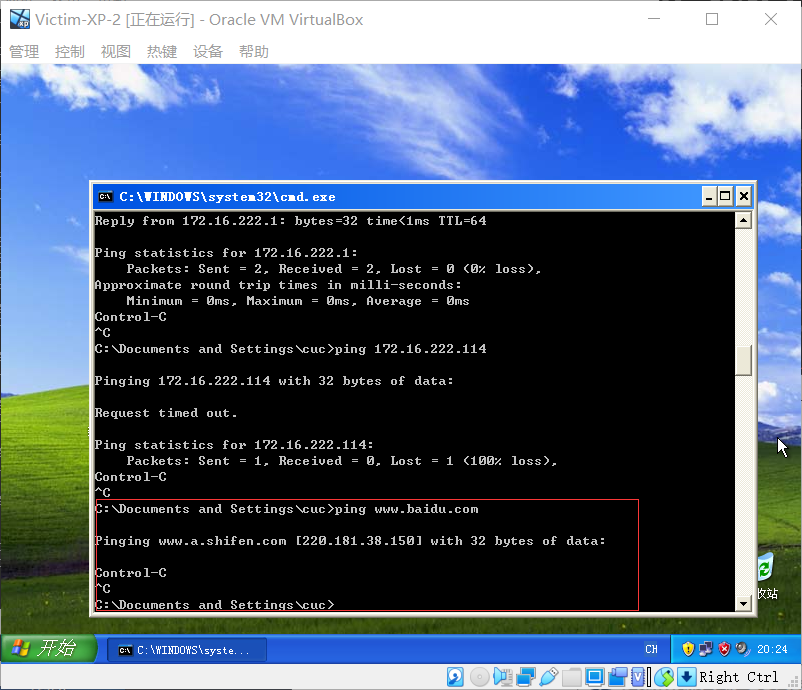
	
- **对内网2中的主机无法访问NAT网和互联网的原因进行排查【以 Victim-XP-2 为例】**

  - 检查xp的网关，发现可以正常上网

    ```bash
    ping -I 172.16.222.1 www.baidu.com
    ```

    

  - 检查网关的路由和xp侧连通性，发现没问题

    ```bash
    # 检查路由
    ip route
    
    # 检查xp侧连通性
    ip neigh
    ```

    

  - 检查网关的防火墙和转发规则，发现没有问题

    ```
    # This file describes the network interfaces available on your system
    # and how to activate them. For more information, see interfaces(5).
    
    source /etc/network/interfaces.d/*
    
    # The loopback network interface
    auto lo
    iface lo inet loopback
    
    # The primary network interface
    allow-hotplug enp0s3
    iface enp0s3 inet dhcp
    allow-hotplug enp0s8
    iface enp0s8 inet dhcp
    allow-hotplug enp0s9
    iface enp0s9 inet static
      address 172.16.111.1
      netmask 255.255.255.0
      post-up echo 1 > /proc/sys/net/ipv4/ip_forward
      post-up   iptables -P FORWARD DROP
      post-up   iptables -t nat -A POSTROUTING -s '172.16.111.0/24' ! -d '172.16.111.0/24' -o enp0s3 -j MASQUERADE
      post-up   iptables -I FORWARD -s '172.16.111.0/24' ! -d '172.16.111.0/24' -i enp0s9 -j ACCEPT
      post-up   iptables -I FORWARD -s '172.16.111.0/24' -d '172.16.222.0/24' -i enp0s9 -j DROP
      post-up   iptables -A FORWARD -m state --state RELATED,ESTABLISHED -j ACCEPT
      post-down iptables -t nat -D POSTROUTING -s '172.16.111.0/24' ! -d '172.16.111.0/24' -o enp0s3 -j ACCEPT
      post-down iptables -D FORWARD -s '172.16.111.0/24' ! -d '172.16.111.0/24' -i enp0s9 -j ACCEPT
      post-down iptables -D FORWARD -m state --state RELATED,ESTABLISHED -j ACCEPT
      post-down iptables -I FORWARD -s '172.16.111.0/24' -d '172.16.222.0/24' -i enp0s9 -j DROP
    allow-hotplug enp0s10
    iface enp0s10 inet static
      address 172.16.222.1
      netmask 255.255.255.0
      post-up   iptables -P FORWARD DROP
      post-up   iptables -t nat -A POSTROUTING -s '172.16.222.0/24' ! -d '172.16.222.0/24' -o enp0s3 -j MASQUERADE
      post-up   iptables -I FORWARD -s '172.16.222.0/24' ! -d '172.16.222.0/24' -i enp0s10 -j ACCEPT
      post-up   iptables -I FORWARD -s '172.16.222.0/24' -d '172.16.111.0/24' -i enp0s10 -j DROP
      post-down iptables -t nat -D POSTROUTING -s '172.16.222.0/24' ! -d '172.16.222.0/24' -o enp0s3 -j MASQUERADE
      post-down iptables -D FORWARD -s '172.16.222.0/24' ! -d '172.16.222.0/24' -i enp0s10 -j ACCEPT
      post-down iptables -I FORWARD -s '172.16.222.0/24' -d '172.16.111.0/24' -i
    ```

  - 检查网关是否开启IPv4转发，发现开启了

  	```bash
  	cat /proc/sys/net/ipv4/ip_forward
  	```

  	
  	
  - 在网上执行以下命令，发现XP还是不能ping通

  	```bash
  	iptables -P FORWARD ACCEPT
  	```
  	
  - 检查xp的网络配置，发现没有问题

    

- **解决方法**
  - 是因为网关的网卡是从 `网络地址转换(NAT) `改成 `NAT 网络`，导致虚拟机出现bug，使得最底层网络连接没有接通
  - 所以重新创建一个网关，先把`NAT 网络` 设置好再启动

### 参考资料

[VirtualBox的多重加载](https://blog.csdn.net/jeanphorn/article/details/45056251?utm_term=virtualbox%E5%A4%9A%E9%87%8D%E5%8A%A0%E8%BD%BD&utm_medium=distribute.pc_aggpage_search_result.none-task-blog-2~all~sobaiduweb~default-0-45056251&spm=3001.4430)
[更新网卡驱动](https://www.jianshu.com/p/4bee5f609d01)
[Windows 10 开启ssh服务](https://www.cnblogs.com/silence22/p/11573267.html)
[ssh远程登录root用户](https://www.cnblogs.com/banxian-yi/p/12361606.html)
[Enter passphrase for ke](https://www.jianshu.com/p/9464be198011)
