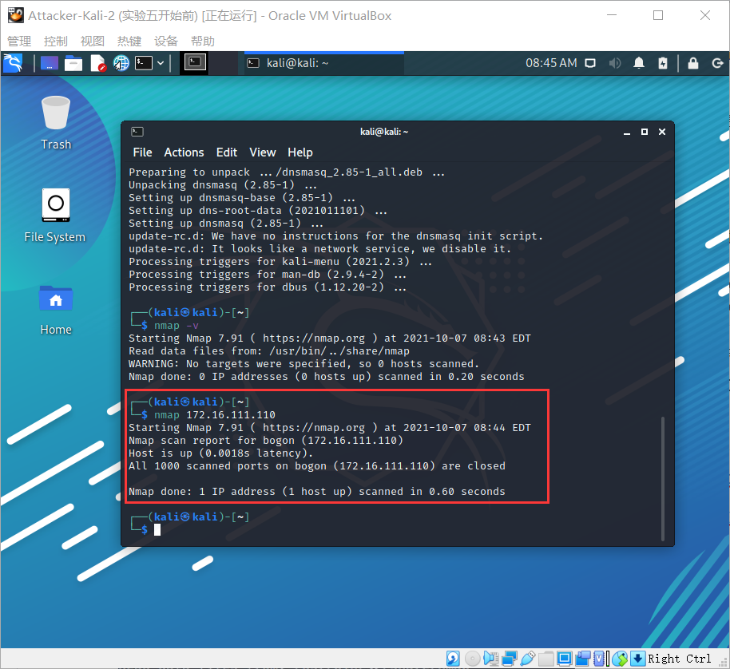
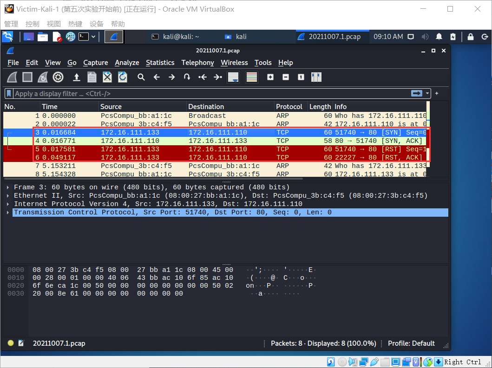
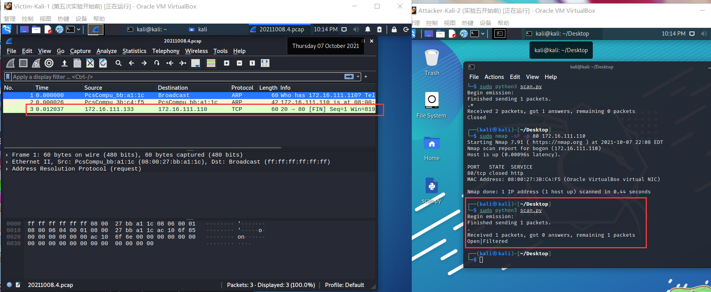

# 实验报告

## 实验目的

掌握网络扫描之端口状态探测的基本原理

## 实验环境

- python + scapy

- 各主机IP地址

  - 网关： `172.16.111.1`
  - 攻击者： `172.16.111.133`
  - 受害者： `172.16.111.110`

- 网络拓扑

  

## 实验要求

- [x] 禁止探测互联网上的 IP ，严格遵守网络安全相关法律法规
- [x]  完成以下扫描技术的编程实现
  - [x]  TCP connect scan / TCP stealth scan
  - [x]  TCP Xmas scan / TCP fin scan / TCP null scan
  - [x]  UDP scan
- [x]  上述每种扫描技术的实现测试均需要测试端口状态为：开放、关闭 和 过滤 状态时的程序执行结果
- [x]  提供每一次扫描测试的抓包结果并分析与课本中的扫描方法原理是否相符？如果不同，试分析原因；
- [x]  在实验报告中详细说明实验网络环境拓扑、被测试 IP 的端口状态是如何模拟的
- [x] （可选）复刻 nmap 的上述扫描技术实现的命令行参数开关

## 实验原理

1. **TCP connect scan**

> 这种扫描方式可以使用 Connect()调用，使用最基本的 TCP 三次握手链接建立机制，建立一个链接到目标主机的特定端口上。首先发送一个 SYN 数据包到目标主机的特定端口上，接着我们可以通过接收包的情况对端口的状态进行判断。

三种情况下的不同响应：

- 接收 SYN/ACK 数据包，说明端口是开放状态的；
- 接收 RST/ACK 数据包，说明端口是关闭的并且链接将会被重置；
- 目标主机没有任何响应，意味着目标主机的端口处于过滤状态。

> 若接收到 SYN/ACK 数据包（即检测到端口是开启的），便发送一个 ACK 确认包到目标主机，这样便完成了三次握手连接机制。成功后再终止连接。

2. **TCP SYN scan**

> 与 TCP Connect 扫描不同，TCP SYN 扫描并不需要打开一个完整的链接。发送一个 SYN 包启动三方握手链接机制，并等待响应。

三种情况下的不同响应：

- 接收到一个 SYN/ACK 包，表示目标端口是开放的；
- 接收到一个 RST/ACK 包，表明目标端口是关闭的；
- 没有响应，说明端口是被过滤的状态。

> 当得到的是一个 SYN/ACK 包时通过发送一个 RST 包立即拆除连接。

3. **TCP Xmas scan**

> Xmas 发送一个 TCP 包，并对 TCP 报文头 FIN、URG 和 PUSH 标记进行设置。

- 若是关闭的端口则响应 RST 报文；
- 开放或过滤状态下的端口则无任何响应

> 优点是隐蔽性好，缺点是需要自己构造数据包，要求拥有超级用户或者授权用户权限。

4. **TCP fin scan**

> 仅发送 FIN 包，它可以直接通过防火墙.

- 如果端口是关闭的就会回复一个 RST 包
- 如果端口是开放或过滤状态则对 FIN 包没有任何响应。

> 其优点是 FIN 数据包能够通过只监测 SYN 包的包过滤器，且隐蔽性高于 SYN 扫描。缺点和 SYN 扫描类似，需要自己构造数据包，要求由超级用户或者授权用户访问专门的系统调用。

5. **TCP null scan**

> 发送一个 TCP 数据包，关闭所有 TCP 报文头标记。

- 只有关闭的端口会发送 RST 响应。

> 其优点和 Xmas 一样是隐蔽性好，缺点也是需要自己构造数据包，要求拥有超级用户或者授权用户权限。

6. **UDP scan**

> UDP 是一个无链接的协议，当我们向目标主机的 UDP 端口发送数据,我们并不能收到一个开放端口的确认信息,或是关闭端口的错误信息。

- 如果收到一个 ICMP 不可到达的回应，那么则认为这个端口是关闭的
- 对于没有回应的端口则认为是开放的，但是如果目标主机安装有防火墙或其它可以过滤数据包的软硬件,那我们发出 UDP 数据包后,将可能得不到任何回应,我们将会见到所有的被扫描端口都是开放的。

UDP扫描比较简单，一般如果返回 `ICMP port unreachable` 说明端口是关闭的，而如果没有回应或有回应(有些UDP服务是有回应的但不常见)则认为是open，但由于UDP的不可靠性，无法判断报文段是丢了还是没有回应，**所以一般扫描器会发送多次**，然后根据结果再判断，这也是为什么UDP扫描这么慢的原因。

## 端口状态模拟

- 在靶机上安装 `ufw` ，在攻击者主机上安装 `dnsmasq`

  ```bash
  sudo apt-get update 
  sudo apt install ufw
  sudo apt-get install dnsmasq
  ```
  - `dnsmasq` 状态操作

    ```shell
    systemctl start dnsmasq # 启动
    systemctl status dnsmasq # 查看状态
    systemctl stop dnsmasq # 关闭
    ```

- **关闭状态**：对应端口没有开启监听，防火墙没有开启

  ```bash
  ufw disable
  systemctl stop apache2 # 关闭端口80
  systemctl stop dnsmasq # 关闭端口53
  ```

- **开启状态**：对应端口开启监听，防火墙处于关闭状态

  - `apache2`基于TCP, 在80端口提供服务
  -  `DNS`服务基于`UDP`,在53端口提供服务

  ```shell
  systemctl start apache2 # 开启80端口
  systemctl start dnsmasq # 开启53端口
  ```

- **过滤状态**：对应端口开启监听, 防火墙开启

  ```bash
  ufw enable && ufw deny 80/tcp
  ufw enable && ufw deny 53/udp
  ```

- 查看初始状态

  

## 实验过程

#### TCP connect scan

- 原理

  

- 代码

  ```python
  import logging
  from scapy.all import *
  logging.getLogger("scapy.runtime").setLevel(logging.ERROR)
  
  dst_ip = "172.16.111.110" # 靶机IP地址
  src_port = RandShort()
  dst_port = 80
  
  print('TCP connect scan:')
  print('-----------------------------------------')
  tcp_connect_scan_resp = sr1(IP(dst=dst_ip)/TCP(sport=src_port,dport=dst_port,flags="S"),timeout=10)
  print('-----------------------------------------')
  
  
  if(str(type(tcp_connect_scan_resp))=="<class 'NoneType'>"):
      print('State of port '+ str(dst_port) +' on '+ str(dst_ip) +": Closed")
  elif(tcp_connect_scan_resp.haslayer(TCP)):
      if(tcp_connect_scan_resp.getlayer(TCP).flags == 0x12):       
          send_rst = sr(IP(dst=dst_ip)/TCP(sport=src_port,dport=dst_port,flags="AR"),timeout=10)
          print('State of port '+ str(dst_port) +' on '+ str(dst_ip) +": Open")
      elif(tcp_connect_scan_resp.getlayer(TCP).flags == 0x14):
          print('State of port '+ str(dst_port) +' on '+ str(dst_ip) +": Closed")
  elif(tcp_connect_scan_resp.haslayer(ICMP)):
      if(int(tcp_connect_scan_resp.getlayer(ICMP).type)==3 and int(tcp_connect_scan_resp.getlayer(ICMP).code) in [1,2,3,9,10,13]):
          print('State of port '+ str(dst_port) +' on '+ str(dst_ip) +": Filtered")
  ```

- 端口开放

  
  - 靶机抓包

    ```bash
    sudo tcpdump -i eth0 -enp -w 20211007.1.pcap
    ```

  - 攻击者执行代码

    ```bash
    sudo python3 scan.py
    ```

  - 查看抓包结果

    

  - nmap 复刻

    ```bash
    nmap -sT -p 80 172.16.111.110
    ```

    

- 端口关闭

  

  - 靶机抓包后执行代码

    ```bash
    sudo tcpdump -i eth0 -enp -w 20211007.2.pcap
    ```

  - 查看抓包结果

    

  - nmap 复刻

    

- 端口过滤

  ```bash
  sudo ufw enable && sudo ufw deny 80/tcp
  ```

  

  - 靶机抓包后执行代码

    ```bash
    sudo tcpdump -i eth0 -enp -w 20211007.3.pcap
    ```

  - 查看抓包结果

    

  - nmap 复刻

    

#### TCP stealth scan

- 原理

  

- 代码

  ```python
  from scapy.all import *
  
  def tcpstealthscan(dst_ip, dst_port, timeout=10):
      pkts = sr1(IP(dst=dst_ip)/TCP(dport=dst_port, flags="S"), timeout=10)
      if (pkts is None): # 如果无响应就是被过滤
          print("Filtered")
      elif(pkts.haslayer(TCP)):# 如果回复了tcp数据
          if(pkts.getlayer(TCP).flags == 0x12):  # Flags: 0x012 (SYN, ACK)，端口开放
              send_rst = sr(IP(dst=dst_ip) /
                            TCP(dport=dst_port, flags="R"), timeout=10)
              print("Open")
          elif (pkts.getlayer(TCP).flags == 0x14):# Flags: 0x014 (RST, ACK)，端口关闭
              print("Closed")
          elif(pkts.haslayer(ICMP)): # receive ICMP and type Destination Unreachable (3)
              if(int(pkts.getlayer(ICMP).type) == 3 and int(stealth_scan_resp.getlayer(ICMP).code) in [1, 2, 3, 9, 10, 13]):
                  print("Filtered")
  
  
  tcpstealthscan('172.16.111.110', 80)
  ```

- 端口开放

  ```bash
  # 关闭防火墙
  sudo ufw disable
  
  systemctl start apache2
  ```

  - 靶机抓包并查看结果

    ```bash
    sudo tcpdump -i eth0 -enp -w 20211007.4.pcap
    ```

    

  - nmap 复刻

    ```bash
    sudo nmap -sS -p 80 172.16.111.110
    ```

    

- 端口关闭

  ```bash
  systemctl stop apache2
  ```

  - 靶机抓包并查看结果

    ```bash
    sudo tcpdump -i eth0 -enp -w 20211007.5.pcap
    ```

    

  - nmap 复刻

    

- 端口过滤

  ```bash
  sudo ufw enable && sudo ufw deny 80/tcp
  ```

  - 靶机抓包并查看结果

    ```bash
    sudo tcpdump -i eth0 -enp -w 20211007.6.pcap
    ```

    

  - nmap 复刻

    

#### TCP Xmas scan

- 原理

  

- 代码

  ```python
  from scapy.all import *
  
  
  def Xmasscan(dst_ip, dst_port, timeout=10):
      pkts = sr1(IP(dst=dst_ip)/TCP(dport=dst_port, flags="FPU"), timeout=10)
      if (pkts is None):
          print("Open or Filtered")
      elif(pkts.haslayer(TCP)):
          if(pkts.getlayer(TCP).flags == 0x14):
              print("Closed")
      elif(pkts.haslayer(ICMP)):
          if(int(pkts.getlayer(ICMP).type) == 3 and int(pkts.getlayer(ICMP).code) in [1, 2, 3, 9, 10, 13]):
              print("Filtered")
  
  
  Xmasscan('172.16.111.110', 80)
  ```


- 端口关闭

  ```bash
  sudo ufw disable
  
  systemctl stop apache2
  ```

  - 靶机抓包并查看结果

    ```bash
    sudo tcpdump -i eth0 -enp -w 20211008.1.pcap
    ```

    

  - nmap 复刻

    ```bash
    sudo nmap -sX -p 80 172.16.111.110
    ```

    

- 端口开启或过滤

  - 两者抓包结果和步骤都相同，只不过过滤多了一步：

    ```bash
    sudo ufw enable && sudo ufw deny 80/tcp
    ```

  - 靶机抓包并查看结果【端口开启和过滤的抓包结果是一样的，这里以端口开启为例】

    ```bash
    sudo tcpdump -i eth0 -enp -w 20211008.2.pcap
    ```

    

  - nmap 复刻

    

#### TCP fin scan

- 原理

  

- 代码

  ```python
  from scapy.all import *
  
  
  def finscan(dst_ip, dst_port, timeout=10):
      pkts = sr1(IP(dst=dst_ip)/TCP(dport=dst_port, flags="F"), timeout=10)
      if (pkts is None):
          print("Open|Filtered")
      elif(pkts.haslayer(TCP)):
          if(pkts.getlayer(TCP).flags == 0x14):
              print("Closed")
      elif(pkts.haslayer(ICMP)):
          if(int(pkts.getlayer(ICMP).type) == 3 and int(pkts.getlayer(ICMP).code) in [1, 2, 3, 9, 10, 13]):
              print("Filtered")
  
  
  finscan('172.16.111.110', 80)
  ```

- 端口关闭

  ```bash
  sudo ufw disable
  
  systemctl stop apache2
  ```

  - 靶机抓包并查看结果

    ```bash
    sudo tcpdump -i eth0 -enp -w 20211008.3.pcap
    ```

    

  - nmap 复刻

    ```bash
    sudo nmap -sF -p 80 172.16.111.110
    ```

    

- 端口开启或过滤

  - 和 `TCP Xmas scan` 一样，过滤只比开启多了一步步骤——`sudo ufw enable && sudo ufw deny 80/tcp`

  - 靶机抓包并查看结果【端口开启和过滤的抓包结果是一样的，这里以端口开启为例】

    ```bash
    sudo tcpdump -i eth0 -enp -w 20211008.4.pcap
    ```

    

  - nmap 复刻

    

#### TCP null scan

- 原理

  

- 代码

  ```python
  from scapy.all import *
  
  
  def nullscan(dst_ip, dst_port, timeout=10):
      pkts = sr1(IP(dst=dst_ip)/TCP(dport=dst_port, flags=""), timeout=10)
      if (pkts is None):
          print("Open|Filtered")
      elif(pkts.haslayer(TCP)):
          if(pkts.getlayer(TCP).flags == 0x14):
              print("Closed")
      elif(pkts.haslayer(ICMP)):
          if(int(pkts.getlayer(ICMP).type) == 3 and int(pkts.getlayer(ICMP).code) in [1, 2, 3, 9, 10, 13]):
              print("Filtered")
  
  
  nullscan('172.16.111.110', 80)
  ```

- 端口关闭

  - 靶机抓包并查看结果

    ```bash
    sudo tcpdump -i eth0 -enp -w 20211008.5.pcap
    ```

    

  - nmap 复刻

    ```bash
    sudo nmap -sN -p 80 172.16.111.110
    ```

    

- 端口开启或过滤
  - 和 `TCP Xmas scan` 一样，过滤只比开启多了一步步骤——`sudo ufw enable && sudo ufw deny 80/tcp`

  - 靶机抓包并查看结果【端口开启和过滤的抓包结果是一样的，这里以端口开启为例】

    ```bash
    sudo tcpdump -i eth0 -enp -w 20211008.6.pcap
    ```

    

  - nmap 复刻

    

#### UDP scan

- 原理

  

- 代码

  ```python
  from scapy.all import *
  
  
  def udpscan(dst_ip, dst_port, dst_timeout=10):
      resp = sr1(IP(dst=dst_ip)/UDP(dport=dst_port), timeout=dst_timeout)
      if (resp is None):
          print("Open|Filtered")
      elif (resp.haslayer(UDP)):
          print("Open")
      elif(resp.haslayer(ICMP)):
          if(int(resp.getlayer(ICMP).type) == 3 and int(resp.getlayer(ICMP).code) == 3):
              print("Closed")
          elif(int(resp.getlayer(ICMP).type) == 3 and int(resp.getlayer(ICMP).code) in [1, 2, 9, 10, 13]):
              print("Filtered")
          elif(resp.haslayer(IP) and resp.getlayer(IP).proto == IP_PROTOS.udp):
              print("Open")
  
  
  udpscan('172.16.111.110', 53)
  ```

- 端口关闭

  ```bash
  sudo ufw disable
  
  sudo systemctl stop dnsmasq
  ```

  - 靶机抓包并查看结果

    ```bash
    sudo tcpdump -i eth0 -enp -w 20211008.7.pcap
    ```

    

  - nmap 复刻

    ```bash
    sudo nmap -sU -p 53 172.16.111.110
    ```

    

- 端口开启

  ```bash
  sudo systemctl start dnsmasq
  ```

  - 靶机抓包并查看结果

    ```bash
    sudo tcpdump -i eth0 -enp -w 20211008.8.pcap
    ```

    

  - nmap 复刻

    

- 端口过滤

  ```bash
  sudo ufw enable && sudo ufw deny 53/udp
  ```

  - 靶机抓包并查看结果

    ```bash
    sudo tcpdump -i eth0 -enp -w 20211008.9.pcap
    ```

    

  - nmap 复刻

    

**每一次扫描测试的抓包结果并分析与课本中的扫描方法原理是否相符？如果不同，试分析原因。**

- 从实验结果截图来看，通过python编程实现的每一次扫描的抓包结果与课本中的扫描方法原理相符

## 实验遇到的问题

#### 问题一

- nmap无法监听到端口过滤的状态

  

#### 解决方法

- 加上 `sudo` 

## 参考资料

[2021-ns-public-Daytoyecho](https://github.com/CUCCS/2021-ns-public-Daytoyecho/blob/chap0x05/chap0x05/chap0x05.md)

[2021-ns-public-EddieXu1125](https://github.com/CUCCS/2021-ns-public-EddieXu1125/blob/chap0x05/chap0x05/README.md)
